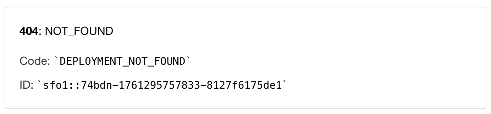

# React Deployment with Vercel


[This lesson](https://verceleployment.surge.sh/) will walk you through the steps to deploy a [Vite](https://vitejs.dev/) React app with [Vercel](https://vercel.com/home). We will walk through all of the necessary steps from start to finish, and even cover how you can choose a custom domain as well.

## Objectives

- Learn how to do a one-time [install](#installing-surge) of Surge globally on your machine
- Set up Surge [environment](#setting-up-surge-environment-variables) variables
- Learn how to set up a custom domain ([optional](#setting-up-a-custom-domain-optional))
- Create a custom build script ([optional](#creating-a-custom-build-script))

## Is a React App a Static Site?

When we use the term "static", we are referring to the fact that the content of the website will not change unless the files are manually updated. The site does *not* interact with a database or involve any [server-side processing](https://en.wikipedia.org/wiki/Server-side). The site will simply display the same information to every user. Typically, static sites are faster and more secure than dynamic sites.

Technically, a React front-end is considered a static site because it serves pre-built files to the browser, and all necessary data is included within the initial load, meaning it doesn't need to query a database or server for every user request. The dynamic interactions are handled through JavaScript ([client-side](https://en.wikipedia.org/wiki/Dynamic_web_page)) which manipulates the DOM elements directly in the browser, without needing to fetch new pages or data from a server. This results in faster load times and a smoother user experience.

This also means that we can use Surge to deploy it!

## Installing Surge

Surge is very easy to install as well. We will perform a global install so that you will always have Surge available to deploy your projects.

***If you have never installed Surge before...***

Run the following command from *any working directory* in your terminal:

```sh
npm install --global surge
```

Since it is global, this is an install you will only ever need to run ***once***, not on a project-by-project basis.

## Setting Up Your Surge Account

***If you have never signed up with Surge before...***

In the root directory of your project, run the following command:

```sh
surge
```

You will be prompted to set up an account with Surge in your command line. Go ahead and do so.

Next, you'll be asked to confirm the project path. If you are in the root directory of your project, this should already be correct. Just press <kbd>enter</kbd> to continue.

You will be automatically assigned a silly (usually) randomly generated domain name for your site. This is ok and we can change it later. Press <kbd>enter</kbd> to continue.


This may or may not succeed. Don't worry. Either way, we are not done yet.

### Setting up Surge Environment Variables

In your front-end .env file (`touch .env` if you don't have one), add the following variables in **SCREAMING_SNAKE_CASE**:

```
SURGE_LOGIN=
SURGE_TOKEN=
```

`SURGE_LOGIN` will be the email you signed up for Surge with. No spaces, no quotes.

In your terminal, run the following command to get your Surge Token:

```sh
npx surge token
```

Paste the returned token to the above environment variable. No spaces, no quotes.

*Make sure to add `.env` to your `.gitignore` file. Never push sensitive information up to GitHub!*

## Building Your Production App

Now, you need to tell Vite to build a production version of your app. If you intend on using a custom domain, [skip ahead](#setting-up-a-custom-domain-optional) to that section. If not, run the following:

```sh
vite build
```

Running the `vite build` command creates a production build of our React App contained in a `/dist` folder. Surge will use this to deploy our app.

## Deploy

Once this completes, you're ready to deploy with Surge. Run the following command:

```sh
npx surge --project ./dist
```

Wait for this to complete. It shouldn't take long. Take note of the domain that Surge selects for you (usually something silly), then navigate to that URL in your browser to see the result! Congratulations, you're deployed!


## Setting Up a Custom Domain (optional)

We can set up a file in your project that will remember the particular domain you want to use. This step is entirely optional.

### Choose a Domain

First, we'll need to see that the URL you want to use is available. Open a browser window and navigate to any surge domain you'd like.

The URL should follow this format:

```sh
https://reactdeployment.surge.sh/
```

If it's available, the URL should show this in the browser:



This means that no one else has deployed a project to this URL, and that it is available to be used. Remember this URL for the next step.

### Creating A Custom Build Script

Next, we'll create a "build" script in our **package.json** that will perform all of the steps we need to run our deployment.

Add the following script ***in*** your `"scripts"` section of your `package.json` file.

If you already have a "build" script, replace it with this:

```json
"build": "vite build && npx surge --project ./dist --domain <SURGE_URL_IN_SINGLE_QUOTES>"
```

Obviously replace the `< >` in the above script with your own information. Pay close attention to the URL in the script above. It ***should be in single quotes***.

Your ***Surge URL*** is what will be used as the entry point to your app. This is what people will see, and the one you'll want to put on your portfolio, LinkedIn, etc.

This script performs the following actions:

1. Runs the *vite build* command that creates a production build of our React App contained in a **/dist** folder
2. Runs the *surge* command to redeploy our app. To ensure it runs automatically without needing any input from us, the project directory and domain options are predefined.

## Deploy

Any time you want to deploy, run the custom script you put in your `package.json` file. Do so from the root of your project:

```sh
npm run build
```

This will run the deployment of our Vite React App to Surge.

## Recap

In this walkthrough, you successfully deployed your Vite React app to Surge.

Any time you make changes to your project that you want reflected on your deployed version, just commit your changes and then run `npm run build` once more.

## Resources

- [Vite Docs](https://vitejs.dev/guide/)
- [Surge Docs](https://surge.sh/help/getting-started-with-surge)
- [Deploy It!](https://deployit.surge.sh/)
