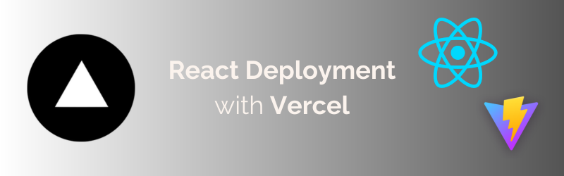

# React Deployment with Vercel



[This lesson](https://vercelreactdeployment.vercel.app/) will walk you through the steps to deploy a [Vite](https://vitejs.dev/) React app with [Vercel](https://vercel.com/home). We will walk through all of the necessary steps from start to finish, and even cover how you can choose a custom domain as well.


## Objectives

- Do a one-time [login](#log-in-to-vercel) to Vercel on your machine
- [Deploy](#deploy) your app to Vercel
- Learn how to set up a custom domain ([optional](#setting-up-a-custom-domain-optional))
- Create a custom build script ([optional](#creating-a-custom-build-script))


## Is a React App a Static Site?

When we use the term "static", we are referring to the fact that the content of the website will not change unless the files are manually updated. The site does *not* interact with a database or involve any [server-side processing](https://en.wikipedia.org/wiki/Server-side). The site will simply display the same information to every user. Typically, static sites are faster and more secure than dynamic sites.

Technically, a React front-end is considered a static site because it serves pre-built files to the browser, and all necessary data is included within the initial load, meaning it doesn't need to query a database or server for every user request. The dynamic interactions are handled through JavaScript ([client-side](https://en.wikipedia.org/wiki/Dynamic_web_page)) which manipulates the DOM elements directly in the browser, without needing to fetch new pages or data from a server. This results in faster load times and a smoother user experience.

This also means that we can use Vercel to deploy it!

Vercel specializes in deploying and hosting these types of sites, and as a result, is extremely light-weight and fast. The feature we love the most is that Vercel is extremely *easy to use*.


## Log In to Vercel

First off, we need to do a one-time login to Vercel on our machine. This should only need to be done once.


### Setting Up Your Vercel Account

***If you have never signed up with Vercel before...***

Visit [Vercel](https://vercel.com/signup) to sign up for a new account.

***After signing up...***

Run the following command from *any working directory* in your terminal:

```sh
npx vercel login
```

You will be prompted to press <kbd>enter</kbd> to open up a browser to sign in to your Vercel account.


## Vite Build

Now, you need to tell Vite to build a production version of your app. If you intend on using a custom domain, [skip ahead](#custom-domain) to that section. If not, run the following:

```sh
vite build
```

Running the `vite build` command creates a production build of our React App contained in a `/dist` folder. Vercel will use this to deploy our app.


## Deploy

You'll need to create a JSON file in the root of your project to tell Vercel how to work with Vite.

```sh
touch vercel.json
```

In this file, paste in the following settings:

```json
{
  "buildCommand": "npm run build",
  "outputDirectory": "dist",
  "rewrites": [{ "source": "/(.*)", "destination": "/index.html" }]
}
```

Now, you're ready to deploy. Run the following command in the root folder of your project:

```sh
npx vercel --prod --yes
```

## Setting Up a Custom Domain (optional)

We can choose the particular domain you want to use with Vercel. This step is entirely optional.


### Choose a Domain

First, we'll need to see that the URL you want to use is available. Open a browser window and navigate to any Vercel domain you'd like.

The URL should follow this format:

```txt
https://vercelreactdeployment.vercel.app/
```

If it's available, the URL should show this or something very similar in the browser:


This means that no one else has deployed a project to this URL, and that it is available to be used. Remember this URL for the next step.


### Creating A Custom Build Script

Next, we'll create a "build" script in our **package.json** that will perform all of the steps we need to run our deployment.

Add the following script ***in*** your `"scripts"` section of your `package.json` file.

If you already have a "build" script, replace it with this:

```json
"build": "vite build && npx vercel --prod --yes --name <VERCEL_URL>"
```

Obviously replace the `< >` in the above script with your own information.

Your ***Vercel URL*** is what will be used as the entry point to your app. This is what people will see, and the one you'll want to put on your portfolio, LinkedIn, etc.

This script performs the following actions:

1. Runs the *vite build* command that creates a production build of your React App contained in a **/dist** folder
2. Runs the *vercel* command to redeploy your app - pointing to your chosen domain


## Re-Deploy

Any time you want to deploy, run the custom script you put in your `package.json` file. Do so from the root of your project:

```sh
npm run build
```

This will run the deployment of our Vite React App to Vercel.


## Recap

In this walkthrough, you successfully deployed your Vite React app to Vercel.

Any time you make changes to your project that you want reflected on your deployed version, just commit your changes and then run `npm run build` once more.

## Resources

- [Vite Docs](https://vitejs.dev/guide/)
- [Vercel Docs](https://vercel.com/docs)
- [Deploy It!](https://deployit.surge.sh/)
